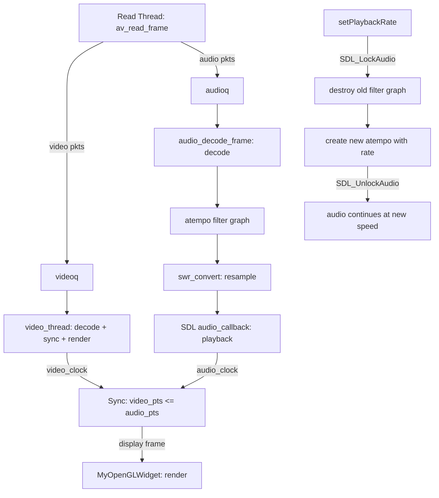

## 用户需求

为现有的 Qt5 + FFmpeg + SDL2 视频播放器实现音视频倍速播放功能。

## 产品概述

在当前播放器的基础上新增倍速播放能力，用户可在播放过程中动态切换播放速度（如 0.5x、0.75x、1.0x、1.25x、1.5x、2.0x），音频变速不变调，视频同步跟随，进度条正确反映媒体时间。

## 核心功能

- 支持 0.5x ~ 2.0x 倍速播放切换（音频不变调）
- 播放过程中可动态切换速度，无需重新打开文件
- 音视频在任意倍速下保持同步
- 进度条和时间显示正确反映媒体时间位置
- 无音频流时，视频也能倍速播放
- UI 控件：倍速选择下拉框，当前速度指示

## 技术栈

- 框架：Qt 5.12 (MinGW 32-bit) + C++
- 音视频解码：FFmpeg 4.2.2（已链接 avfilter 库）
- 音频输出：SDL2 2.0.10
- 视频渲染：QOpenGLWidget (OpenGL 2D 纹理)
- 构建系统：qmake (.pri 模块配置)

## 实现方案

### 核心策略

使用 FFmpeg 的 **atempo 音频滤镜**实现变速不变调。atempo 滤镜可动态调整音频播放速率（0.5~100.0），通过改变输出采样点数实现时间拉伸，同时保持音调不变。音视频同步无需修改核心逻辑——audio_clock 和 video_clock 均跟踪媒体时间，在倍速下两者以相同加速率推进，同步条件 `video_pts <= audio_pts` 自然成立。

### 关键技术决策

**1. 音频变速：atempo 滤镜（而非修改采样率）**

- 方案A（atempo）：变速不变调，质量最佳，需要新增 filter graph 管线
- 方案B（修改 swr_convert 输出采样率）：简单但会变调（花栗鼠效果），不可接受
- 选择方案A，avfilter.lib 已在 .pri 中链接

**2. 滤镜图结构**

```
abuffer (解码帧输入) → atempo (速率调整) → abuffersink (输出到SDL)
```

**3. 倍速切换实现**

- 切换速度时销毁旧 filter graph，创建新的 atempo 滤镜
- 使用 `SDL_LockAudio()/SDL_UnlockAudio()` 保护切换过程，避免音频回调冲突
- 切换时会有极短音频断裂，可接受

**4. 音视频同步无需改动核心逻辑**

- audio_clock 由 PTS 驱动，atempo 使音频消耗更快，audio_clock 推进更快
- video_clock 由帧延迟驱动，同步循环自动适配音频加速
- 两者在媒体时间维度上自然对齐

**5. 无音频流时的倍速**

- timer_callback 返回 `interval / playback_rate`，使定时器触发更频繁
- 存储原始帧间隔 `base_frame_interval_ms` 到 VideoState

### 数据流变更

**当前音频管线**：

```
av_read_frame → audioq → avcodec_decode_audio4 → swr_convert → SDL audio_buf
```

**新增 atempo 后的音频管线**：

```
av_read_frame → audioq → avcodec_decode_audio4 → av_buffersrc_add_frame → atempo → av_buffersink_get_frame → swr_convert → SDL audio_buf
```

## 实现要点

### 性能注意

- 当前 `audio_decode_frame()` 每帧创建/销毁 swr_ctx，效率低但可用；新增 filter graph 初始化一次，避免重复开销
- atempo 滤镜内部缓冲区引入少量延迟（约几十毫秒），对用户体验无明显影响
- 倍速下读取线程消费更快，队列大小阈值 MAX_AUDIO_SIZE/MAX_VIDEO_SIZE 已足够缓冲

### 线程安全

- `setPlaybackRate()` 从 Qt 主线程调用，filter graph 在 SDL 音频回调线程使用
- 使用 `SDL_LockAudio()/SDL_UnlockAudio()` 确保切换时音频回调不执行
- playback_rate 字段用 `volatile` 或在锁保护下读写

### 边界情况

- atempo 仅支持 0.5~100.0 范围，UI 限制最大 2.0x
- 滤镜初始化失败时回退到 1.0x 正常播放
- 暂停状态下切换倍速，恢复后按新速度播放
- seek 操作后滤镜图状态清空，需重新输入帧

## 架构设计



## 目录结构

```
NetDisk/mediaplayer/
├── videoplayer.h           # [MODIFY] 添加 playback_rate、filter graph 字段和 setPlaybackRate 接口
├── videoplayer.cpp         # [MODIFY] 核心改动：新增滤镜初始化/销毁函数，修改 audio_decode_frame 流程，修改 timer_callback，实现 setPlaybackRate
├── playerdialog.h          # [MODIFY] 添加倍速切换槽函数声明
├── playerdialog.cpp        # [MODIFY] 实现倍速切换逻辑，连接 UI 与 VideoPlayer
├── playerdialog.ui         # [MODIFY] 在控制栏添加 QComboBox 倍速选择控件
├── PacketQueue.h           # [无需修改]
├── PacketQueue.cpp         # [无需修改]
├── mediaplayer.pri         # [无需修改] avfilter.lib 已链接
└── opengl/                 # [无需修改]
```

### 文件修改详情

**videoplayer.h** [MODIFY]

- 在 `extern "C"` 块中新增头文件：`libavfilter/avfilter.h`、`libavfilter/buffersrc.h`、`libavfilter/buffersink.h`
- VideoState 结构体新增字段：`double playback_rate`、`AVFilterGraph *filter_graph`、`AVFilterContext *src_filter_ctx`、`AVFilterContext *sink_filter_ctx`、`bool filter_inited`、`double base_frame_interval_ms`
- VideoPlayer 类新增方法：`void setPlaybackRate(double rate)`、`double playbackRate() const`
- 新增信号：`void SIG_PlaybackRateChanged(double rate)`

**videoplayer.cpp** [MODIFY]

- 新增 `init_audio_filters(VideoState *is)` 函数：创建 abuffer→atempo→abuffersink 滤镜图
- 新增 `deinit_audio_filters(VideoState *is)` 函数：销毁滤镜图并置空指针
- 修改 `audio_decode_frame()`：解码后将帧推入 src_filter_ctx，从 sink_filter_ctx 拉取过滤后帧，再 swr_convert 输出
- 修改 `timer_callback()`：返回值改为 `interval / is->playback_rate` 实现无音频倍速
- 修改 `run()` 中 `SDL_AddTimer` 调用：初始间隔改为 `pts_diff * 1000 / playback_rate`
- 新增 `setPlaybackRate()` 实现：SDL_LockAudio → 更新 rate → 重建滤镜图 → SDL_UnlockAudio → 发信号
- 修改 `stop()` 中清理逻辑：调用 `deinit_audio_filters()`
- 修改 `run()` 中资源回收：调用 `deinit_audio_filters()`

**playerdialog.h** [MODIFY]

- 新增槽函数：`void on_cb_speed_currentIndexChanged(int index)`

**playerdialog.cpp** [MODIFY]

- 实现 `on_cb_speed_currentIndexChanged()`：调用 `m_player->setPlaybackRate()`

**playerdialog.ui** [MODIFY]

- 在 controlLayout 中 pb_stop 之后、spacer 之前添加 QComboBox，名称 `cb_speed`
- 选项：0.5x, 0.75x, 1.0x(默认选中), 1.25x, 1.5x, 2.0x

## 关键代码结构

```cpp
// VideoState 新增字段
typedef struct VideoState {
    // ... existing fields ...
    double playback_rate;                     // 播放速率，默认1.0
    AVFilterGraph *filter_graph;              // 音频滤镜图
    AVFilterContext *src_filter_ctx;           // abuffer 源滤镜
    AVFilterContext *sink_filter_ctx;          // abuffersink 汇滤镜
    bool filter_inited;                        // 滤镜图是否已初始化
    double base_frame_interval_ms;             // 无音频时的原始帧间隔(ms)
    // ...
} VideoState;

// VideoPlayer 新增接口
class VideoPlayer : public QThread {
    // ... existing ...
public:
    void setPlaybackRate(double rate);         // 设置播放速率(0.5~2.0)
    double playbackRate() const;               // 获取当前速率
signals:
    void SIG_PlaybackRateChanged(double rate); // 速率变更通知
};
```

## 设计方案

在现有播放器界面控制栏中嵌入倍速选择控件，保持界面简洁统一。

### 倍速控件设计

- 在底部控制栏"停止"按钮右侧、弹性空白之前添加 QComboBox 倍速选择器
- 下拉框宽度紧凑，仅显示当前速度值（如"1.0x"）
- 下拉选项：0.5x / 0.75x / 1.0x / 1.25x / 1.5x / 2.0x
- 默认选中 1.0x
- 选择后立即生效，无需确认
- 字体与现有按钮一致（微软雅黑 11pt）

### 布局调整

控制栏水平布局变更为：[打开] [播放/恢复/暂停] [停止] [倍速▼] [←弹性空白→]

### 视觉风格

- 下拉框样式与现有 QPushButton 保持一致的深色主题
- 当前选中速度以高亮色标识
- 切换速度时无弹窗，直接切换